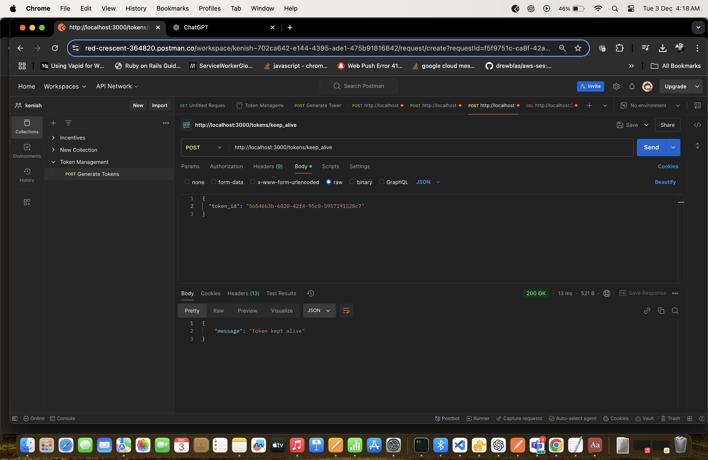

This service is responsible for managing tokens that can be generated, assigned, unblocked, deleted, and kept alive. It uses Redis for storing and managing tokens, supporting operations like token creation, token allocation, expiration handling, and cleanup.

Features
Generate Tokens: Create a specified number of tokens, which are added to an available pool.
Assign Token: Assign an available token from the pool, marking it as "allocated."
Unblock Token: Unblock a previously allocated token, returning it to the available pool.
Delete Token: Permanently delete a token from the system.
Keep Token Alive: Extend the expiration of an allocated token to keep it alive for further use.
API Endpoints
Generate Tokens
POST /tokens/generate
Parameters:
count (integer) - number of tokens to generate.
Response:
List of token IDs.

Assign Token
POST /tokens/assign

Unblock Token
POST /tokens/unblock
Parameters:
token_id (string) - ID of the token to unblock.

Delete Token
POST /tokens/delete
Parameters:
token_id (string) - ID of the token to delete.

Keep Token Alive
POST /tokens/keep_alive

If you don't have Ruby 2.6.6 installed, you can install it using rbenv (recommended) or rvm.

Using rbenv:
Install rbenv if you don’t have it:

brew install rbenv
Install Ruby 2.6.6:

rbenv install 2.6.6
Set Ruby 2.6.6 as the global version:

rbenv global 2.6.6

Step 2: Install Rails 6.1.7
Once Ruby is installed, you can install Rails 6.1.7:

gem install rails -v 6.1.7
Check if Rails is installed correctly:

rails -v

Step 3: Clone the Repository
Clone the repository to your local machine:

git clone https://github.com/kenish26/token-management-service.git
cd token-management-service

gem install bundler
bundle install

brew install redis
redis-server
rails server

.png)

